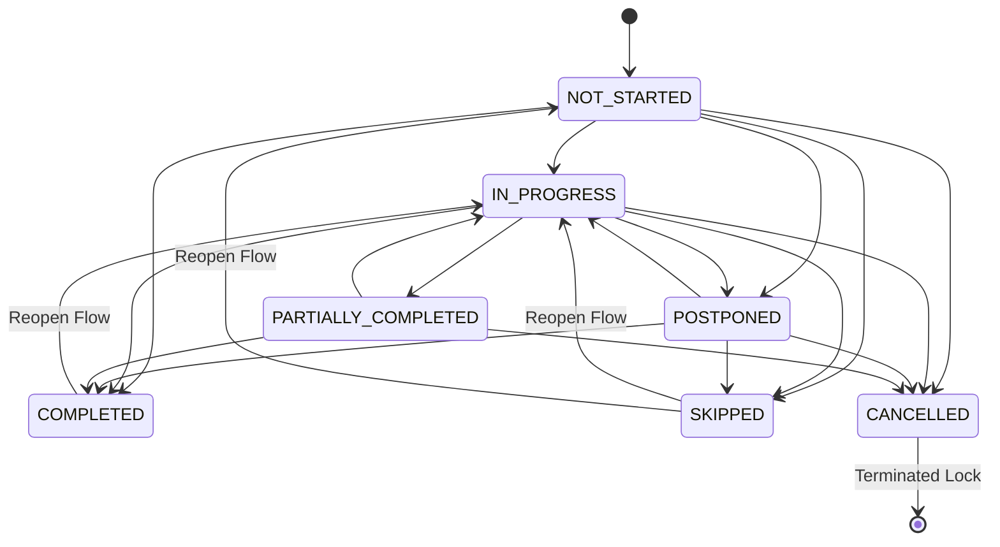

# Governance Freeze — Academic Session Progress Tracking & Completion Intelligence

This document establishes the frozen governance guidelines and specifications for SOPHIA's **Academic Session Progress Tracking System**. These rules ensure deterministic execution semantics, replay safety, precise cognitive load diagnostics, and retrieval-safe history for future D3 reasoning systems.

---

## 1. Core Semantics of Session Progress States

The execution layer defines distinct operational states separate from scheduling status:

| Progress State | Authoritative Meaning | wasActuallyHeld | progressPercentage |
|---|---|---|---|
| `NOT_STARTED` | Session has not begun or taken place yet. | `false` | `0` |
| `IN_PROGRESS` | Session is currently active/ongoing. | `true` | `1% - 99%` (default `50%`) |
| `COMPLETED` | Session was fully completed. | `true` | `100` |
| `PARTIALLY_COMPLETED` | Session took place but was cut short or incomplete. | `true` | `1% - 99%` (user-defined) |
| `POSTPONED` | Session was delayed and will be rescheduled later. | `false` | `0` |
| `SKIPPED` | Session was skipped entirely with no replacement. | `false` | `0` |
| `CANCELLED` | Session was canceled and permanently deleted. | `false` | `0` |

---

## 2. Deterministic State Transition Matrix

All progress state transitions must validate against this matrix. Invalid transitions are strictly rejected.

- **Terminal State Lock**: `CANCELLED` is a final terminal state. No transitions are allowed out of `CANCELLED` directly. Rescheduling requires explicit creation/override mechanisms.
- **Reopening Action**: Reopening a `COMPLETED` or `PARTIALLY_COMPLETED` session sets `completedAt = null`, transitions progressState back to `IN_PROGRESS` (or `NOT_STARTED`), preserves notes/metadata, and logs a `SESSION_REOPENED` mutation.

---

## 3. Terminal-State Governance Lock (Archiving Protection)

To protect historical database records from retrospective academic execution corruption:
- Completed or finalized sessions are permanently **locked** after a governance window of **7 days** (10080 minutes) from `completedAt`.
- Direct reopening is strictly blocked unless the `allowOverride` flag is explicitly provided and logged in the mutation audit trail.

---

## 4. Execution Timestamp Validation

- Actual execution times (`actualStartTime` and `actualEndTime`) must satisfy the inequality:
  `actualEndTime >= actualStartTime`
- Marking a session as `COMPLETED` requires both actual timestamps to be set, unless bypassed intentionally via the `bypassTimestamps` parameter during a "Quick Complete" toggle or admin override.

---

## 5. Stronger Progress Percentage Governance

- **`COMPLETED`**: Always forced to exactly `100%`.
- **`IN_PROGRESS`**: Defaults to `50%` unless custom-defined.
- **`PARTIALLY_COMPLETED`**: Requires an explicit user-defined percentage between `1%` and `99%`.
- **`POSTPONED`, `CANCELLED`, `SKIPPED`, `NOT_STARTED`**: Always forced to exactly `0%`.

---

## 6. Cognitive Load Calculations & Telemetry

Operational progress states directly affect daily cognitive load scoring:

- **`COMPLETED`**: Contributes full load weight (100% of duration minutes).
- **`PARTIALLY_COMPLETED` & `IN_PROGRESS`**: Contributes scaled partial load (`durationMinutes * (progressPercentage / 100)`).
- **`POSTPONED` & `CANCELLED`**: Contributes `0` load weight on the original scheduled day (deferred academic load).
- **`SKIPPED`**: Contributes `0` active load but is flagged in analytics as unresolved academic debt (attendance friction risk).

---

## 7. Optimistic Concurrency Protection

- All progress mutations must check for concurrency race conditions.
- Before committing, the database session's `updatedAt` timestamp must match the client's `lastUpdatedAt` token.
- If they differ, the mutation is rejected with `CONCURRENCY_VIOLATION`.

---

## 8. Audit Mutation Schemas & Actors

All progress modifications emit append-only `TimelineMutationLog` entries containing:
- `actorUserId`: Identifies the user committing the change.
- `actorType`: Semantics include `"USER"`, `"SYSTEM"`, `"CRON"`.
- `triggerSource`: Semantics include `"WEB_INTERFACE"`, `"API"`, `"MUTATION_SHIFTER"`.
- `previousState` and `newState` JSON snapshots for complete replay safety.
