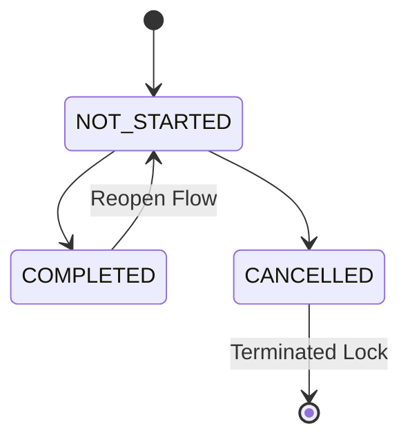

# Governance Freeze — Academic Session Progress Tracking & Completion Intelligence

This document establishes the frozen governance guidelines and specifications for SOPHIA's **Academic Session Progress Tracking System**. These rules ensure deterministic execution semantics, replay safety, precise cognitive load diagnostics, and retrieval-safe history for future D3 reasoning systems.

---

## 1. Core Semantics of Session Progress States & UX Simplification

While the backend database/API layer supports granular operational states for telemetry compatibility, **the User Interface (UX) is simplified to show and toggle binary progress**:

- **`NOT_STARTED` (Belum Terlaksana)**: Sesi belum dilaksanakan.
- **`COMPLETED` (Sudah Terlaksana)**: Sesi telah selesai dilaksanakan secara penuh (100% progres).
- **`CANCELLED` (Dibatalkan)**: Sesi dibatalkan secara permanen (ditampilkan secara redup/muted di UI).

The simplified client progress checklist directly transitions the state between `NOT_STARTED` and `COMPLETED`.

---

## 2. Deterministic Timeline Operations

Rather than bundling reschedule options inside a single progress or cancel modal, the timeline sequence distinguishes operations into explicit, sequence-aware actions:

1. **Override Session**: Modifies only the selected session's parameters (e.g., date, room, link) without affecting downstream slots.
2. **Shift Academic Sequence (Cascading Shift)**: Shifts the selected session and all subsequent downstream sessions. The engine calculates target dates strictly preserving the course's `normalWeekday` pattern (e.g., shifts a Monday class by 7 days, pushing all downstream sessions by exactly 1 week) to prevent magic-number schedule drifts.
3. **Replacement Session**: Creates a dedicated make-up class with the same sequence number, linked to the cancelled parent session via `replacementForId`, maintaining sequence integrity.
4. **Cancel Session**: Marks the session status and progressState as `CANCELLED` permanently instead of deleting, maintaining full audit trails and preventing sequence index corruption.

---

## 3. Deterministic State Transition Matrix

All progress state transitions validate against this matrix. Invalid transitions are strictly rejected.

- **Terminal State Lock**: `CANCELLED` is a final terminal state. No transitions are allowed out of `CANCELLED` directly. Rescheduling/make-up classes are handled via dedicated **Replacement Sessions**.
- **Reopening Action**: Reopening a `COMPLETED` session sets `completedAt = null`, transitions progressState back to `NOT_STARTED`, clears `completedAt` audit parameters, and logs a `SESSION_REOPENED` mutation.

---

## 3. Terminal-State Governance Lock (Archiving Protection)

To protect historical database records from retrospective academic execution corruption:
- Completed or finalized sessions are permanently **locked** after a governance window of **7 days** (10080 minutes) from `completedAt`.
- Direct reopening is strictly blocked unless the `allowOverride` flag is explicitly provided and logged in the mutation audit trail.

---

## 4. Execution Timestamp Validation

- Actual execution times (`actualStartTime` and `actualEndTime`) must satisfy the inequality:
  `actualEndTime >= actualStartTime`
- Marking a session as `COMPLETED` requires both actual timestamps to be set, unless bypassed intentionally via the `bypassTimestamps` parameter during a "Quick Complete" toggle or admin override.

---

## 5. Stronger Progress Percentage Governance

- **`COMPLETED`**: Always forced to exactly `100%`.
- **`IN_PROGRESS`**: Defaults to `50%` unless custom-defined.
- **`PARTIALLY_COMPLETED`**: Requires an explicit user-defined percentage between `1%` and `99%`.
- **`POSTPONED`, `CANCELLED`, `SKIPPED`, `NOT_STARTED`**: Always forced to exactly `0%`.

---

## 6. Cognitive Load Calculations & Telemetry

Operational progress states directly affect daily cognitive load scoring:

- **`COMPLETED`**: Contributes full load weight (100% of duration minutes).
- **`PARTIALLY_COMPLETED` & `IN_PROGRESS`**: Contributes scaled partial load (`durationMinutes * (progressPercentage / 100)`).
- **`POSTPONED` & `CANCELLED`**: Contributes `0` load weight on the original scheduled day (deferred academic load).
- **`SKIPPED`**: Contributes `0` active load but is flagged in analytics as unresolved academic debt (attendance friction risk).

---

## 7. Optimistic Concurrency Protection

- All progress mutations must check for concurrency race conditions.
- Before committing, the database session's `updatedAt` timestamp must match the client's `lastUpdatedAt` token.
- If they differ, the mutation is rejected with `CONCURRENCY_VIOLATION`.

---

## 8. Audit Mutation Schemas & Actors

All progress modifications emit append-only `TimelineMutationLog` entries containing:
- `actorUserId`: Identifies the user committing the change.
- `actorType`: Semantics include `"USER"`, `"SYSTEM"`, `"CRON"`.
- `triggerSource`: Semantics include `"WEB_INTERFACE"`, `"API"`, `"MUTATION_SHIFTER"`.
- `previousState` and `newState` JSON snapshots for complete replay safety.
